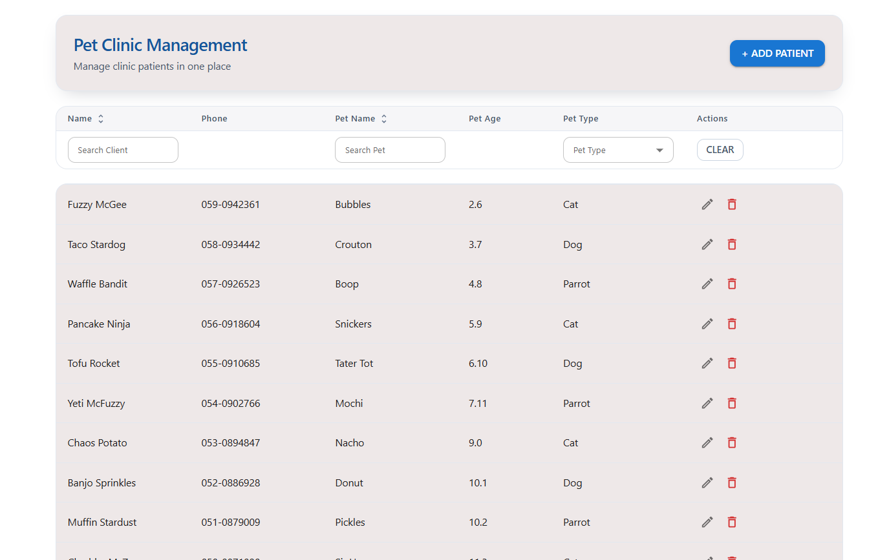
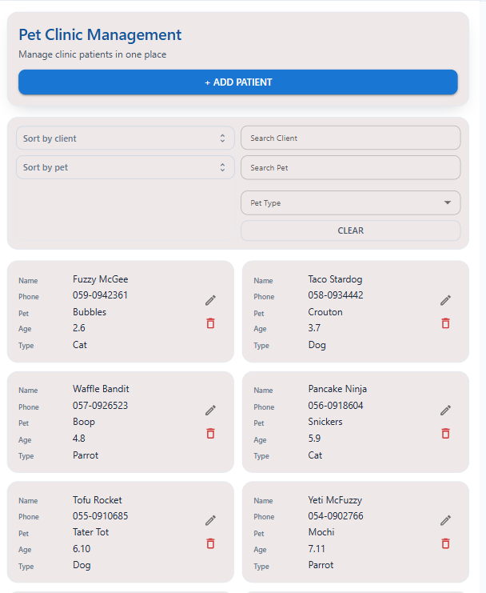
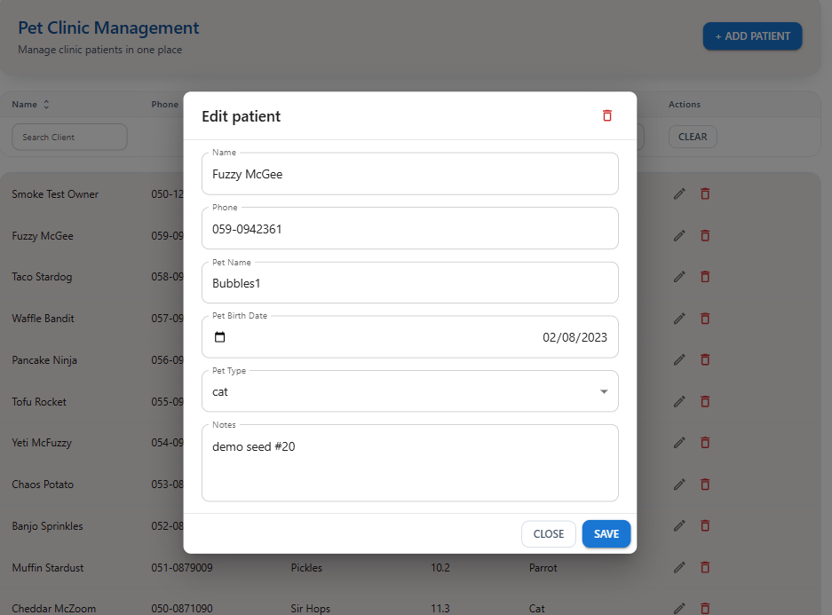

# Pet Clinic Management App

Prepared by Dan Ribak

Single-page Pet Clinic client management application built for an interview task.

## Overview

This project manages pet clinic patients with:

- client list view
- add/edit modal
- delete confirmation
- filtering
- frontend sorting
- Next.js API routes backed by MongoDB

## Tech Stack

- Next.js (App Router + API routes)
- TypeScript
- MongoDB (native driver)
- Tailwind CSS
- MUI
- TanStack React Query
- TanStack React Table

## Key Product Decisions

These are the most important implementation decisions made during the project:

1. Next.js App Router was chosen so UI and API can live in the same codebase with simple file-based routing.
2. MongoDB uses the native `mongodb` driver instead of Mongoose to keep the persistence layer lean and explicit.
3. API routes are separated from the DB layer:
   - `src/app/api/*` handles HTTP
   - `src/services/*` handles data access and validation
4. React Query is used for all client-side data fetching/mutations and cache invalidation.
5. TanStack Table is used for table structure and rendering logic.
6. Filtering is handled through API query params, while sorting for `Name` and `Pet Name` is intentionally done in the frontend.
7. One modal component supports both `add` and `edit` flows to keep the UI DRY.
8. The mobile layout is intentionally different from desktop:
   - compact stacked filters
   - patient cards instead of the full desktop table

## Project Structure

```text
src/
  app/
    api/
    layout.tsx
    page.tsx
  components/clients/
  hooks/
  lib/api/
  providers/
  services/
  types/
plan/
scripts/
```

## Why The `plan/` Folder Is In The Repo

The full planning process is intentionally committed under `plan/`.

This is part of the project, not temporary clutter.

It exists to:

- improve readability of the implementation process
- document technical decisions and tradeoffs
- make task progress easy to track
- show how the project was broken into manageable delivery steps

Current planning files:

- `plan/001-pet-clinic-management-app.md`
- `plan/002-mongo-model-validation-plan.md`
- `plan/003-api-routes-plan.md`
- `plan/004-react-query-integration-plan.md`
- `plan/005-table-and-modal-ui-plan.md`
- `plan/006-responsive-polish-and-animation-plan.md`
- `plan/007-add-frontend-sorting-name-petname.md`
- `plan/008-qa-pass-and-seed-data-plan.md`

## Features

- List patients on a single page
- Add patient
- Edit patient
- Delete patient
- Filter by:
  - client name
  - pet name
  - pet type (multi-select)
- Sort by:
  - client name
  - pet name
- Responsive desktop/mobile layouts
- Seed demo data through the API

## API Endpoints

- `GET /api/clients`
- `POST /api/clients`
- `GET /api/clients/:id`
- `PUT /api/clients/:id`
- `DELETE /api/clients/:id`

Response format:

```json
{
  "data": {},
  "error": null
}
```

or

```json
{
  "data": null,
  "error": {
    "message": "..."
  }
}
```

## Local Setup

1. Install dependencies

```bash
npm install
```

2. Create `.env.local`

```env
MONGODB_URI=your_mongodb_connection_string
MONGODB_DB=pet-clinic
```

3. Run the app

```bash
npm run dev
```

4. Open:

```text
http://localhost:3000
```

## Useful Scripts

- `npm run dev`
- `npm run lint`
- `npx tsc --noEmit`
- `npm run smoke:api`
- `npm run smoke:api:clean`
- `node scripts/api-smoke-test.mjs --seed 20`

## Seed Data

Demo data can be created through the app API:

```bash
node scripts/api-smoke-test.mjs --seed 20
```

Notes:

- this seeds through the real API, not by writing directly to MongoDB
- it appends records, it does not clear the database first

## Screenshots

### Desktop Main Page



### Mobile Main Page



### Add Modal


### Edit Modal



## QA Status

Core flows were validated:

- API smoke test passed
- lint passed
- typecheck passed
- invalid id and invalid payload API paths were verified

## Notes

- Frontend sorting is intentionally client-side
- Filtering is intentionally server-driven
- The UI combines Tailwind for layout and MUI for form/dialog primitives

Prepared by Dan Ribak
